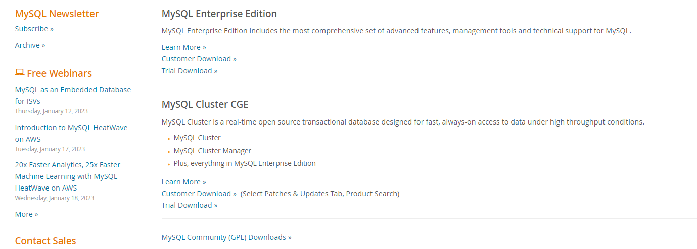
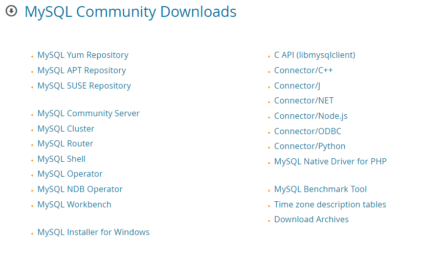
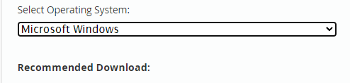
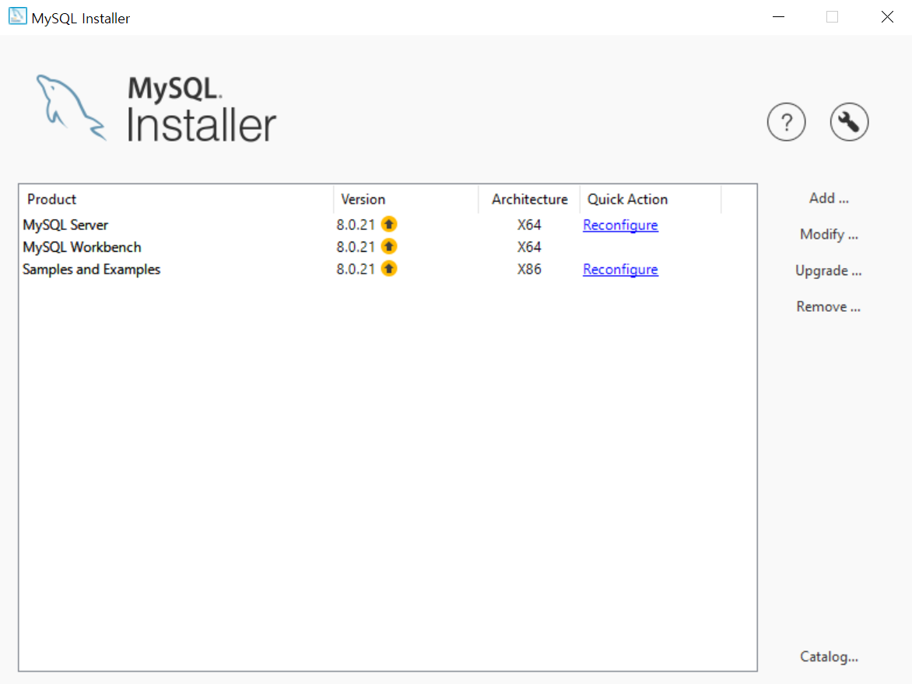

# 필기 노트

## My SQL 설치 정리

1. 다운로드 페이지의 커뮤니티 버전 설치
    
    > 하단의 MYSQL Community GPL downloads 클릭

2. 커뮤니티 서버 설치

    
    > 위에서 4번째의 Community Server 클릭

    2-1. 로컬 환경에 맞는 설정 세팅
    2-1-2 OS
    

3. MysQl Installer 실행
    